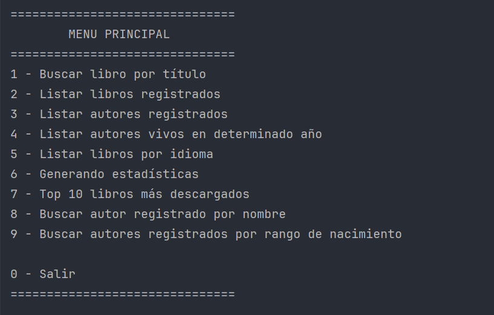
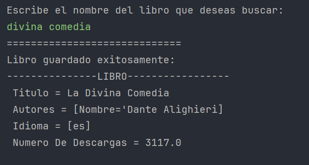

# Challenge-Literatura

Una aplicación en Java que utiliza la API Gutendex para obtener información sobre libros y registrarlos en una base de datos PostgreSQL, además de ofrecer consultas y análisis sobre estos datos.

## **Descripción**

Esta aplicación permite recopilar información detallada sobre libros desde la API Gutendex y registrarla en una base de datos PostgreSQL. También ofrece múltiples funcionalidades para realizar consultas sobre los datos registrados o directamente desde la API, como la generación de estadísticas y la búsqueda de autores por rangos específicos.

## Características principales

- **Registrar libros y autores** en una base de datos PostgreSQL.
- Mostrar:
  - Listado de libros registrados.
  - Listado de autores registrados.
- Consultas avanzadas:
  - Listar autores vivos en determinado año.
  - Listar libros por idioma.
  - Generar estadísticas de descargas.
  - Top 10 libros más descargados.
  - Buscar autor por nombre.
  - Buscar autores por rango de nacimiento.

## **Requisitos**

- **Java 17** o superior.
- **Maven** para la construcción y gestión de dependencias.
- PostgreSQL configurado como base de datos,instalado y configurado previamente..
- Una consola para ejecutar la aplicación.

## **Instrucciones de instalación**

1. Clona el repositorio:
   ```bash
   git clone https://github.com/Anny-rox/Challenge-literatura.git
   cd Challenge-literatura
   ```

2.2. **Configurar la base de datos PostgreSQL:**

   - Crear una base de datos con las credenciales que utilizas en la configuración de tu aplicación.
   - Actualizar el archivo `application.properties` en tu proyecto para que coincidan las credenciales.
     
  ```properties
  spring.datasource.url=jdbc:postgresql://localhost/nombre_base_datos
  spring.datasource.username=tu_usuario
  spring.datasource.password=tu_contraseña
  spring.jpa.hibernate.ddl-auto=update
  ```


3. Construye el proyecto usando Maven:
   ```bash
   mvn clean install
   ```

4. Ejecuta la aplicación desde consola:
   ```bash
   mvn spring-boot:run
   ```
   

## **Capturas de pantalla**

## Menú Principal



## Ejemplos de uso

### Buscar y registrar libros


### Estadísticas de descargas


### Listado de libros registrados


### Top 10 libros más descargados


## **Créditos**

Desarrollado por **Ana Roxana Marca Guzmán** como parte del programa **ONE (Oracle Next Education)**.

## **Licencia**

[MIT](LICENSE) 


## Instalación y ejecución

1. Clona el repositorio:
   ```bash
   git clone https://github.com/tu-usuario/Challenge-literatura.git
   ```

2. Ingresa al directorio del proyecto:
   ```bash
   cd Challenge-literatura
   ```

3. Construye el proyecto usando Maven:
   ```bash
   mvn clean install
   ```

4. Ejecuta la aplicación:
   ```bash
   java -jar target/challenge-literatura-1.0.jar
   ```


