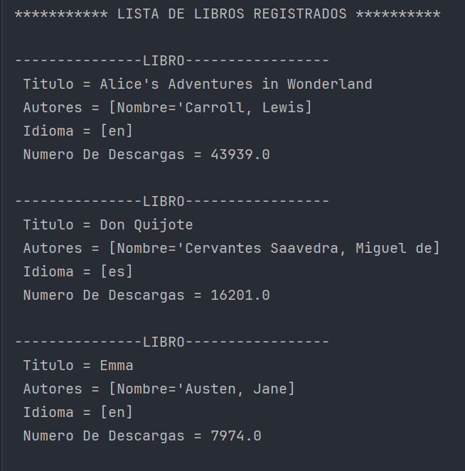
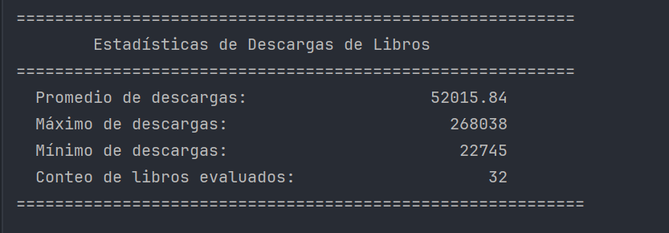
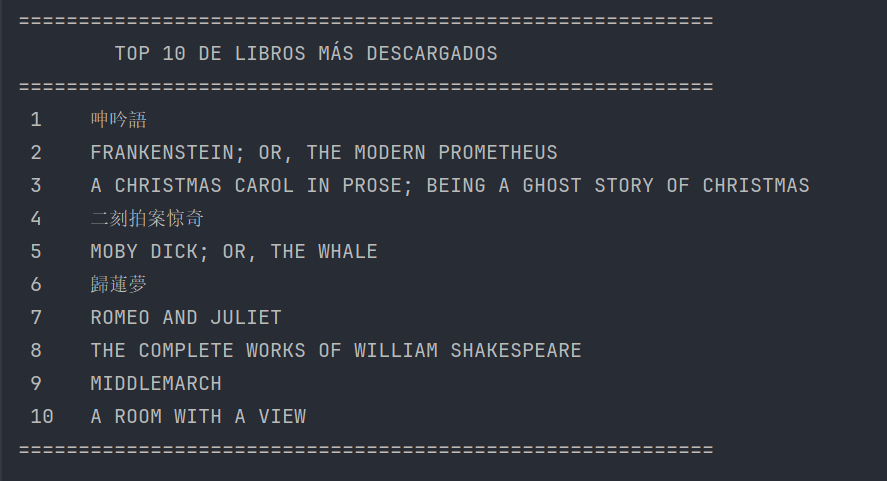

# Challenge-Literatura

Una aplicación en Java que utiliza la API Gutendex para obtener información sobre libros y realizar consultas avanzadas con una base de datos PostgreSQL.

## **Descripción**

Esta aplicación permite recopilar información detallada sobre libros desde la API Gutendex y registrarla en una base de datos PostgreSQL. También ofrece múltiples funcionalidades para realizar consultas sobre los datos registrados o directamente desde la API, como la generación de estadísticas y la búsqueda de autores por rangos específicos.

## **Características principales**

- Registro automático de libros y autores en PostgreSQL.
- Funcionalidades disponibles desde un menú interactivo:
  1. Registrar los libros y sus autores en la base de datos en PostgreSQL.
  2. Mostrar el listado de libros en consola.
  3. Mostrar el listado de autores en consola.
  4. Listar autores vivos en un año específico.
  5. Listar libros por idioma.
  6. Generar estadísticas (API).
  7. Top 10 libros más descargados (API).
  8. Buscar autores por nombre (Base de datos).
  9. Buscar autores registrados por rango de nacimiento (Base de datos).

## **Requisitos**

- **Java** 8 o superior.
- Consola de comandos.
- PostgreSQL configurado como base de datos.

## **Instrucciones de instalación**

1. **Clonar el repositorio:**

   ```bash
   git clone https://github.com/TU_USUARIO/Challenge-literatura.git
   cd Challenge-literatura
   ```

2. **Configurar la base de datos PostgreSQL:**

   - Crear una base de datos con las credenciales que utilizas en la configuración de tu aplicación.
   - Actualizar el archivo `application.properties` en tu proyecto para que coincidan las credenciales.

3. **Compilar y ejecutar el proyecto:**

   - Ejecutar el siguiente comando desde la raíz del proyecto:
     ```bash
     mvn spring-boot:run
     ```

## **Capturas de pantalla**

## Menú Principal
Aquí está el menú principal de la aplicación, donde se presentan las opciones disponibles:


## Registrar y Buscar Libros
La aplicación permite buscar libros y registrarlos en la base de datos PostgreSQL:


## Libros Registrados
Este es un ejemplo de los libros registrados que se pueden listar desde la base de datos:


## Estadísticas
Genera estadísticas sobre las descargas de libros directamente desde la API:


## Top 10 Libros Más Descargados
Este es un ejemplo del ranking generado por la aplicación:



## **Créditos**

Desarrollado por **Ana Roxana Marca Guzmán** como parte del programa **ONE (Oracle Next Education)**.

## **Licencia**

[MIT](LICENSE) 

